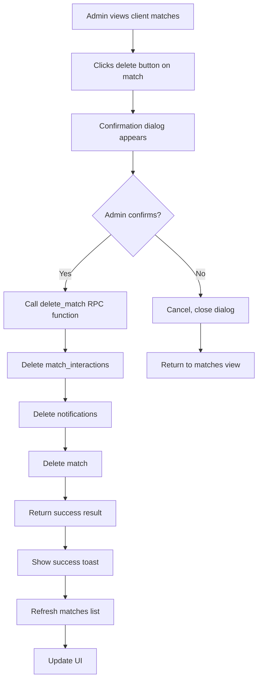
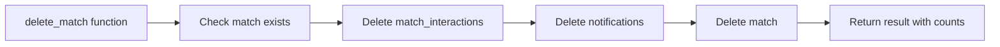
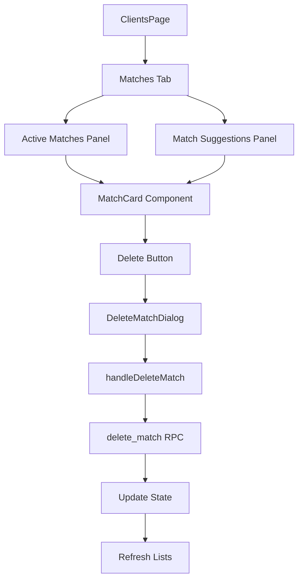

# Match Deletion Flow Diagram

## User Interaction Flow

## Database Deletion Flow

## Component Structure

## Key Implementation Points

1. **MatchCard Component Enhancement**
   - Add delete button with proper event handling
   - Prevent click event bubbling to avoid opening match details

2. **State Management**
   - Add deleteMatchDialogOpen state
   - Add deletingMatchId state to track which match is being deleted

3. **API Integration**
   - Use existing delete_match RPC function
   - Handle success/error responses appropriately

4. **UI Updates**
   - Refresh both active matches and suggestions after deletion
   - Show appropriate toast notifications